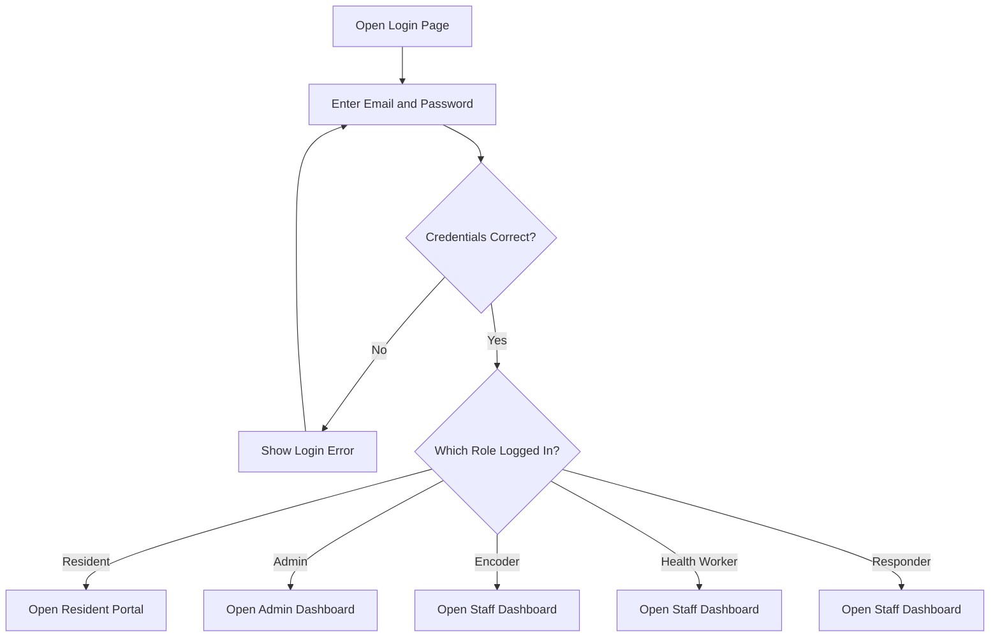
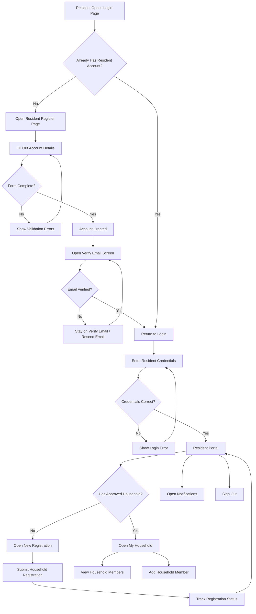
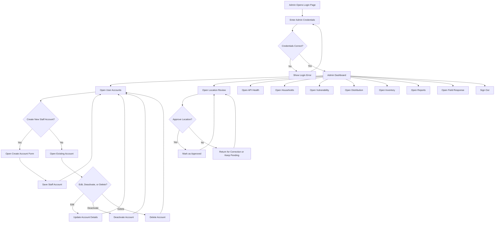
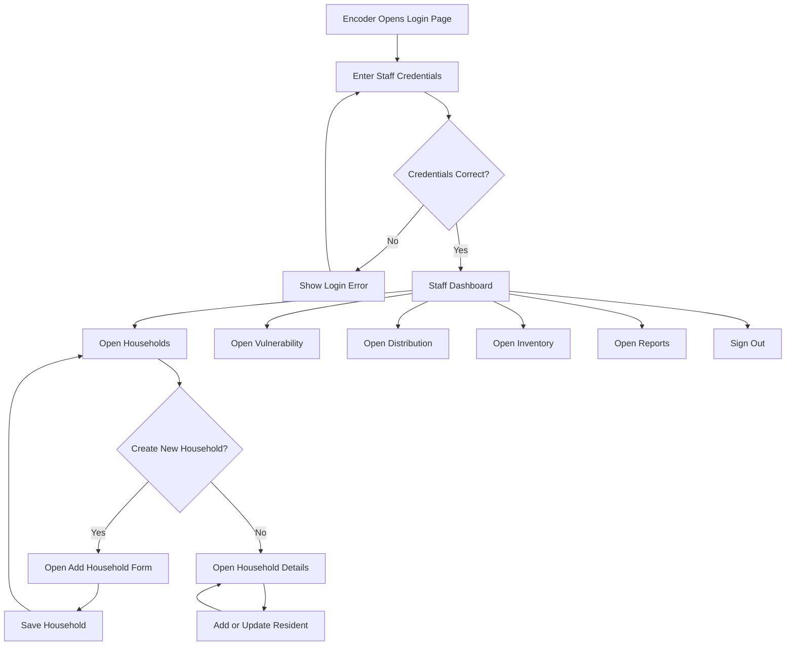
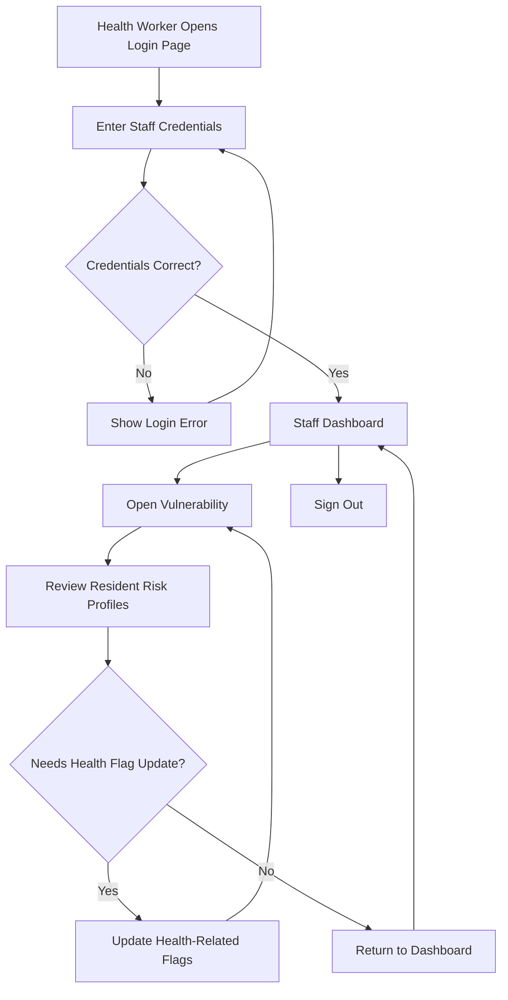
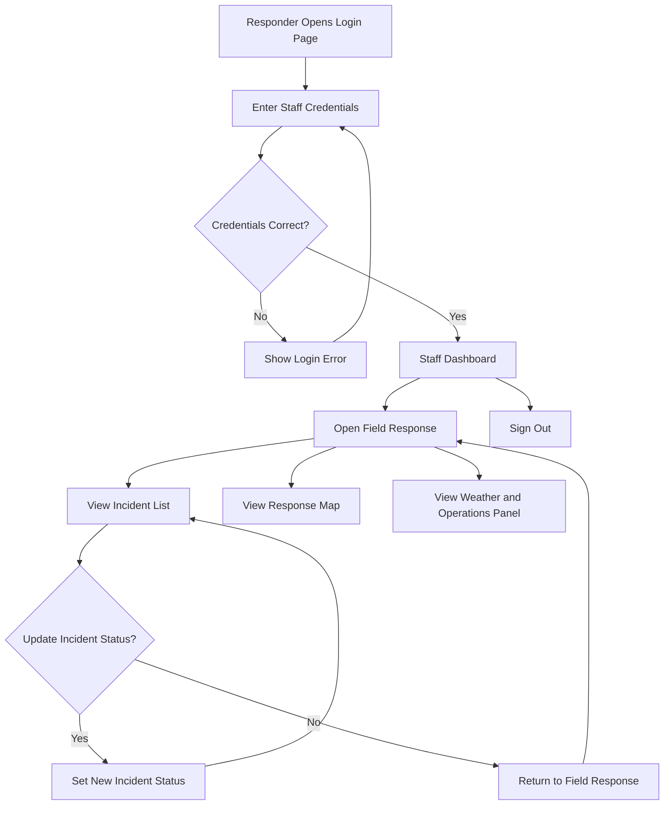

# Role-Based UI/UX Flowchart

This document is intentionally limited to UI/UX flow only.

- No database layer
- No API layer
- No IndexedDB or Supabase details
- Only screens, roles, and visible user decisions

## 1. Shared Entry Flow



## 2. Resident Account Flow



## 3. Admin Account Flow



## 4. Encoder Staff Flow



## 5. Health Worker Staff Flow



## 6. Responder Staff Flow



## 7. Role Access Summary

```text
Resident
- Login
- Register
- Verify Email
- Resident Portal
- New Registration
- Registration Status
- My Household
- Notifications

Admin
- Dashboard
- User Accounts
- Location Review
- API Health
- Households
- Vulnerability
- Distribution
- Inventory
- Reports
- Field Response

Encoder
- Dashboard
- Households
- Vulnerability
- Distribution
- Inventory
- Reports

Health Worker
- Dashboard
- Vulnerability

Responder
- Dashboard
- Field Response
```
