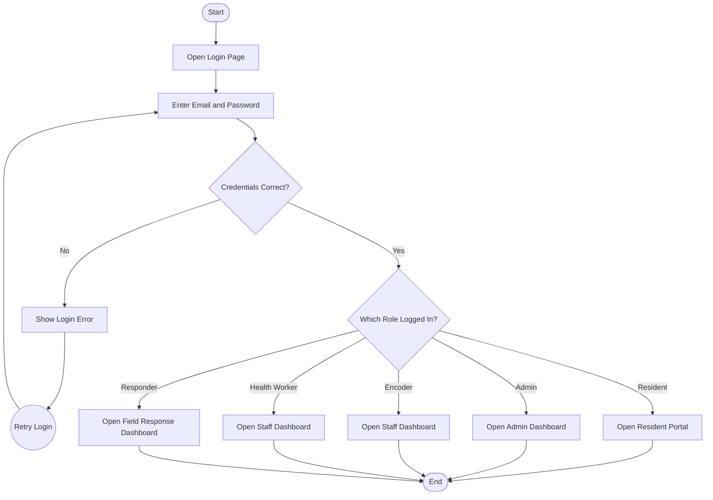
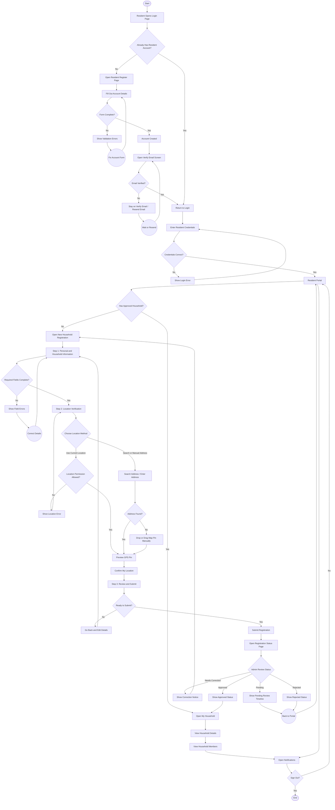
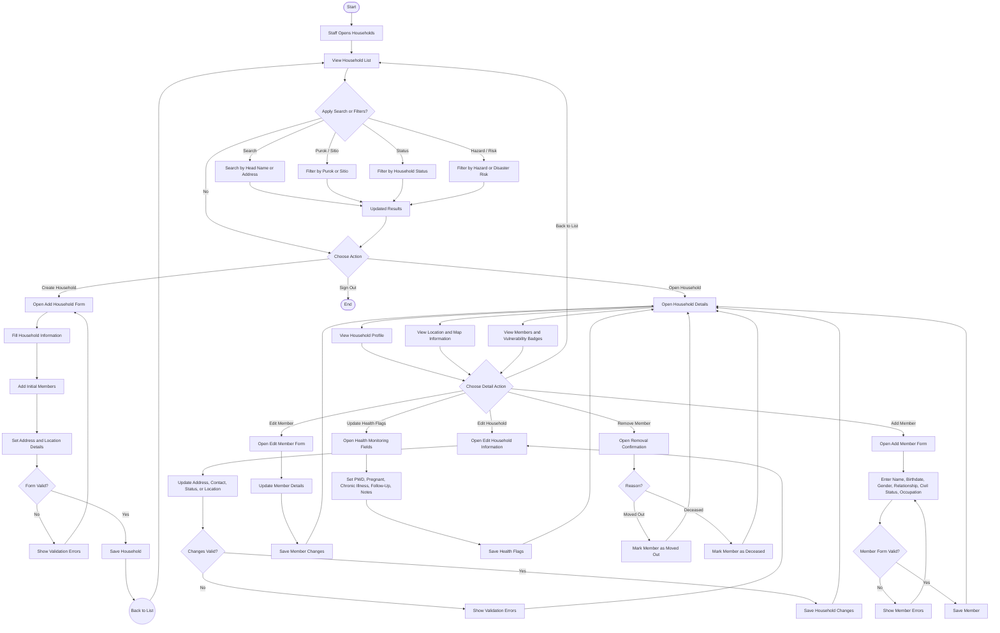
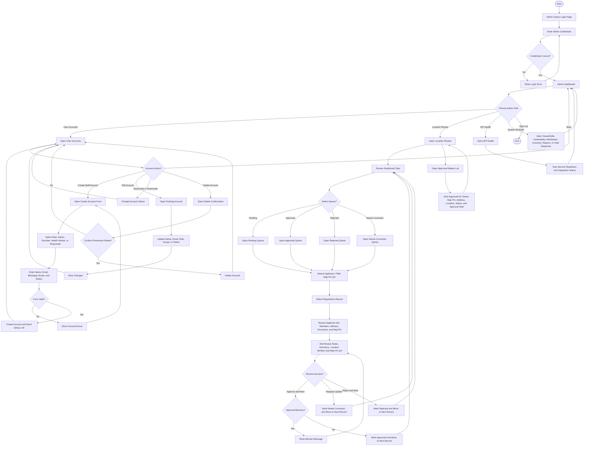
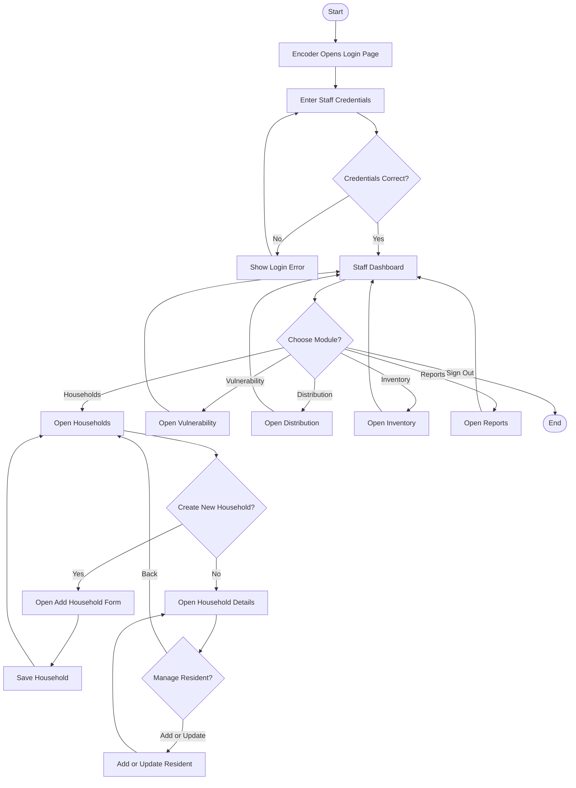
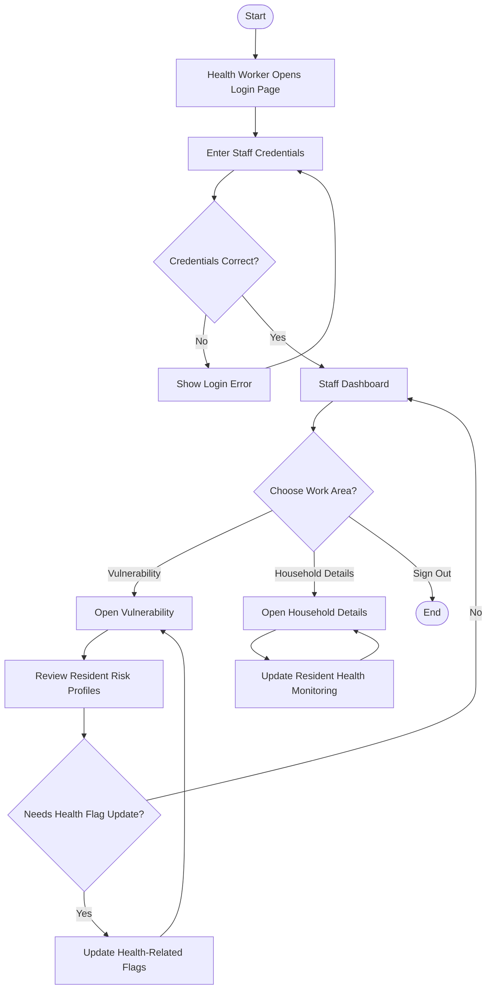
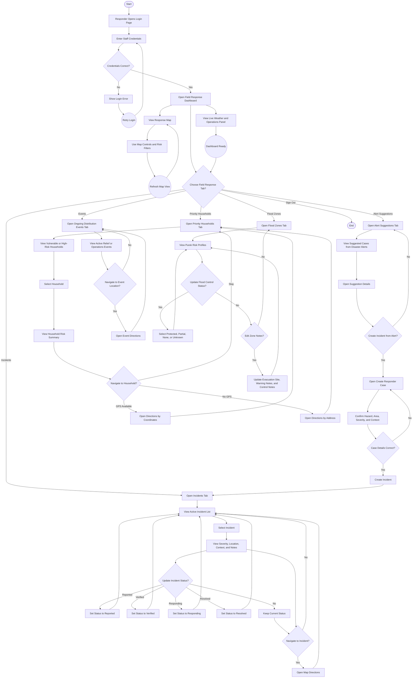

# Role-Based UI/UX Flowchart

This document is intentionally limited to UI/UX flow only.

- No database layer
- No API layer
- No IndexedDB or Supabase details
- Only screens, roles, visible user decisions, and user-facing paths

## Flowchart Symbol Guide

```text
([Start / End]) = Terminator
[Screen / Process] = Page, action, or visible UI step
{Decision?} = Decision diamond
((Connector)) = Loop or return connector
```

## 1. Shared Entry Flow



## 2. Resident and Household Self-Service Flow



## 3. Staff Household Management Flow



## 4. Admin Account and Review Flow



## 5. Encoder Staff Flow



## 6. Health Worker Staff Flow



## 7. Responder Field Response Flow



## 8. Role Access Summary

```text
Resident
- Login
- Register
- Verify Email
- Resident Portal
- New Household Registration
- Registration Status
- My Household
- Notifications

Admin
- Dashboard
- User Accounts
- Location Review
- API Health
- Households
- Vulnerability
- Distribution
- Inventory
- Reports
- Field Response
- Alerts

Encoder
- Dashboard
- Households
- Household Details
- Resident Add/Edit
- Vulnerability
- Distribution
- Inventory
- Reports

Health Worker
- Dashboard
- Vulnerability
- Household Details
- Health Monitoring Flags

Responder
- Field Response Dashboard
- Incidents
- Alert Suggestions
- Priority Households
- Ongoing Events
- Flood Zones
- Response Map
```
