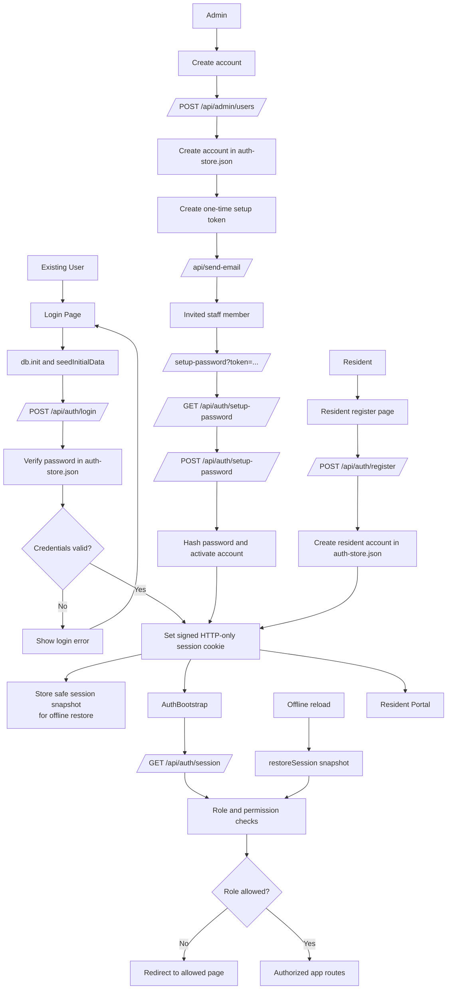
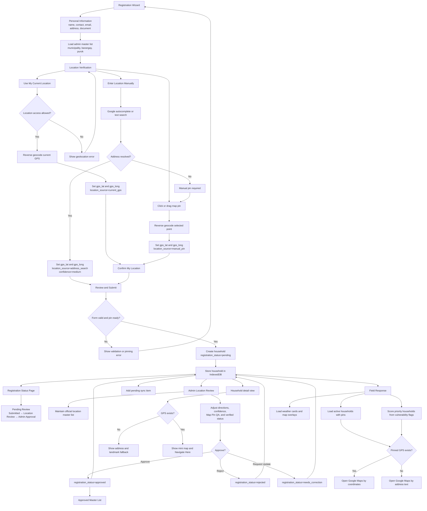
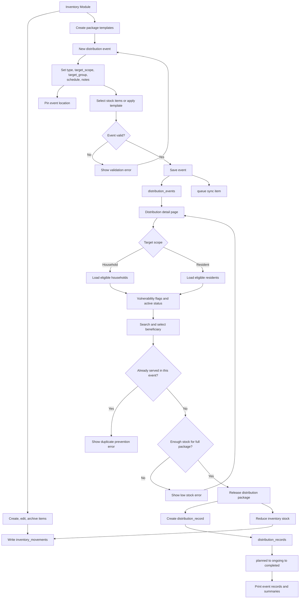
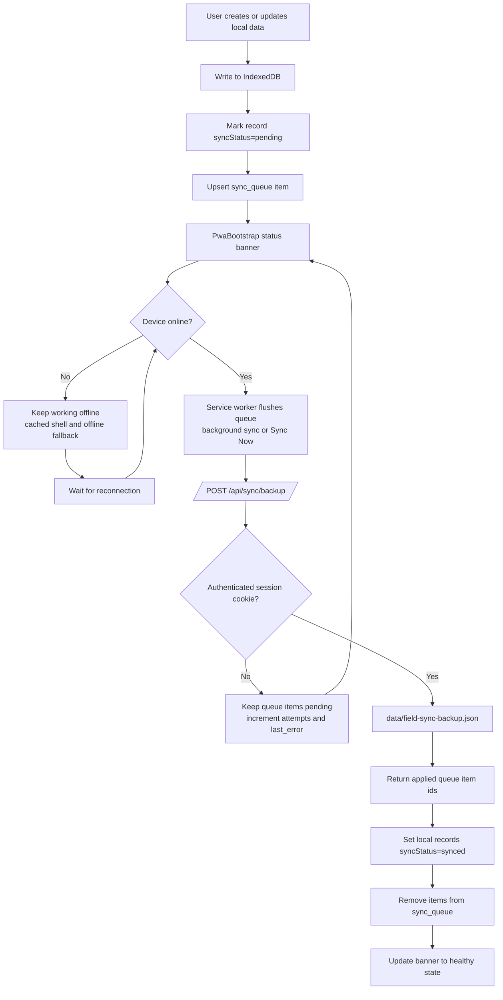
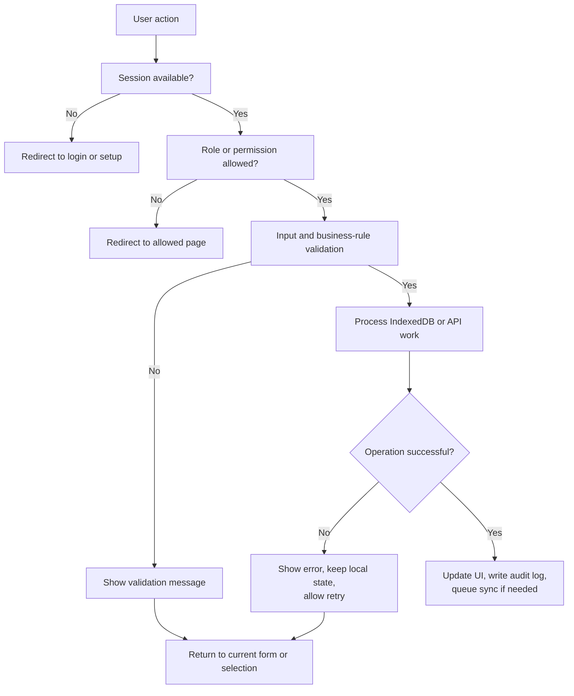

# MSWDO Census PWA System Flowchart

This flowchart reflects the current codebase as of 2026-03-19.

Key source anchors:
- `lib/auth.ts`
- `lib/server/auth-store.ts`
- `components/forms/household-form.tsx`
- `app/admin/location-review/page.tsx`
- `views/desktop/ResponderDesktop.tsx`
- `lib/db/distribution.ts`
- `public/sw.js`

## 1. Current Whole-System Overview

```mermaid
flowchart TD
    U[Users]
    A[Admin]
    E[Encoder]
    H[Health Worker]
    R[Responder]
    RS[Resident]
    N[Invited Staff]

    U --> A
    U --> E
    U --> H
    U --> R
    U --> RS
    U --> N

    A --> AUTH[Secure Session Auth<br/>HTTP-only cookie + offline snapshot]
    E --> AUTH
    H --> AUTH
    R --> AUTH
    RS --> RESAUTH[Resident self-service register and login]
    N --> SETUP[Password Setup Link]
    SETUP --> AUTH
    RESAUTH --> AUTH

    AUTH --> APP[Next.js App Router + AppShell]

    APP --> DASH[Dashboard KPIs]
    APP --> HH[Households]
    APP --> VUL[Vulnerability]
    APP --> RESP[Field Response]
    APP --> DIST[Distribution]
    APP --> INV[Inventory]
    APP --> REP[Reports]
    APP --> ADMUSERS[Admin User Accounts]
    APP --> ADMLOC[Admin Location Review]
    APP --> ADMHEALTH[Admin API Health]
    APP --> RESPOR[Resident Portal]

    HH --> HHCRUD[Household and Resident CRUD]
    HHCRUD --> LOCFLOW[Address Search and GPS Pin Flow]
    HHCRUD --> VCALC[Auto Vulnerability Calculation]

    H --> HEALTHFLAGS[Manual Health Flags<br/>pregnant, PWD, chronic]
    HEALTHFLAGS --> VCALC

    VCALC --> DASH
    VCALC --> VUL
    VCALC --> DIST
    VCALC --> REP
    VCALC --> RESP

    RESP --> INC[Incident Monitoring]
    RESP --> PRIORITY[Priority Check-ins]
    RESP --> MAP[Google Map View]
    RESP --> WEATHER[Live Weather and Map Overlays]
    RESP --> EVENTS[Ongoing Distribution Events]

    DIST --> ELIGIBLE[Eligible Household or Resident Selection]
    DIST --> DREC[Distribution Records]
    DIST --> STOCKREL[Inventory Release]

    INV --> ITEMS[Inventory Items]
    INV --> MOVES[Inventory Movements]
    INV --> PACKS[Package Templates]
    PACKS --> DIST

    REP --> PRINT[Print, CSV, and PDF Export]

    APP --> IDB[IndexedDB Offline Stores]
    IDB --> HHS[households]
    IDB --> RESS[residents]
    IDB --> VFS[vulnerability_flags]
    IDB --> INVS[inventory_items]
    IDB --> MOVS[inventory_movements]
    IDB --> PKGS[package_templates]
    IDB --> DEVS[distribution_events]
    IDB --> DRS[distribution_records]
    IDB --> INCS[incidents]
    IDB --> LMS[location_master_lists]
    IDB --> AUD[audit_logs]
    IDB --> SYNCQ[sync_queue]

    APP --> PWA[PWA Bootstrap + Service Worker]
    PWA --> CACHE[Offline Shell and Cached Routes]
    PWA --> BGSYNC[Background Backup Sync]
    BGSYNC --> BACKUPAPI[/api/sync/backup/]
    BACKUPAPI --> BACKUPFILE[data/field-sync-backup.json]

    AUTH --> AUTHPATHS[/api/auth/login<br/>/api/auth/session<br/>/api/auth/logout/]
    RESAUTH --> RESAPIS[/api/auth/register/]
    ADMUSERS --> USERAPI[/api/admin/users/]
    USERAPI --> AUTHSTORE[data/auth-store.json]
    SETUP --> SETUPAPI[/api/auth/setup-password/]
    ADMUSERS --> EMAIL[/api/send-email/]

    LOCFLOW --> GMAPS[Google Maps, Places, Geocoding]
    RESP --> OWM[OpenWeather API]
    ADMHEALTH --> HEALTHAPI[/api/health/]
```

## 2. Authentication, Session, and Account Onboarding

## 3. Registration Wizard to Admin Approval to Field Response

## 4. Distribution and Inventory Flow

## 5. Offline-First Sync and Backup Flow

## 6. Common Guard, Validation, and Error Handling

